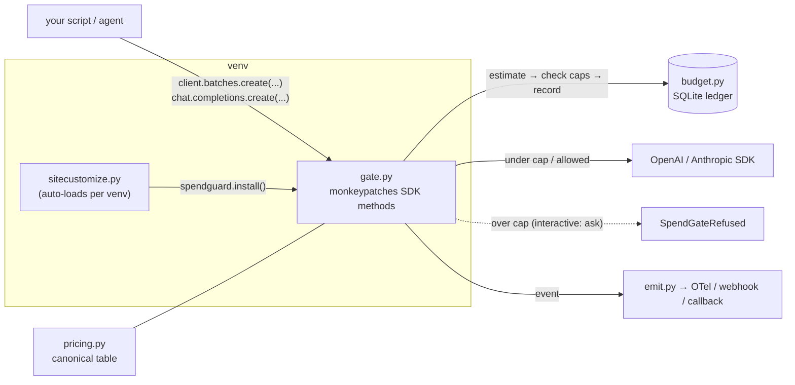
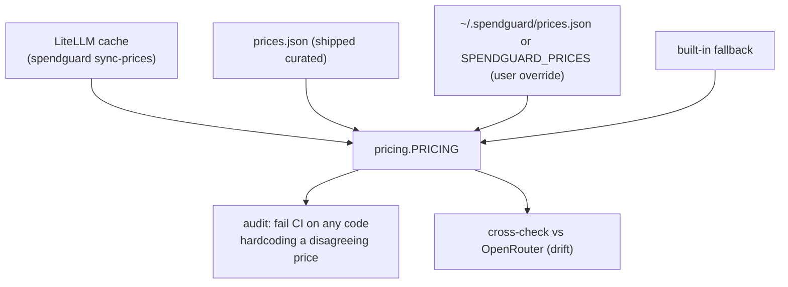
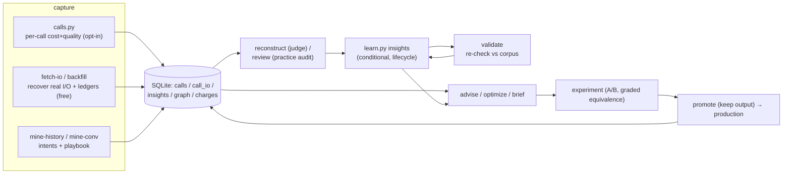

# Architecture

spendguard sits **between your code and the provider SDKs** and does four things in a loop:
**enforce → see → plan/prove → learn.** It's a library + CLI, not a service: zero required deps, all
state in `$SPENDGUARD_HOME` (default `~/.spendguard`), fail-open everywhere.

## 1. The chokepoint (how the gate attaches)

- `install()` (idempotent) wraps `files.create`/`batches.create` (batch) and `chat.completions.create`/
  `messages.create` (real-time) via `_wrap`/`_wrap_rt`. Every wrapped call runs through **`_guard`**, which
  lets only a deliberate `SpendGateRefused` propagate — any other error logs and **fails open** (a job is
  never broken by an internal fault).
- Kill switches (`GATE_DISABLE=1`, `spendguard off`) are checked in `sitecustomize.py` *before* importing
  the package, so disabling works even if the package is broken.
- **Caps:** per-batch (`GATE_CAP`), cross-process daily/monthly (`budget.py` + SQLite, when
  `budget.backend=sqlite`), and a separate **meta** cap for spendguard's own LLM use. Over-cap = hard stop,
  but *asks* "allow anyway?" when interactive; `GATE_ALLOW=1` forces non-interactive runs.

## 2. Pricing resolution (one canonical number)

Precedence: user override > LiteLLM cache > curated `prices.json` > fallback. Cost = `(_cost)` with cached
tokens clamped to input; provider semantics normalized (OpenAI input includes cached; Anthropic excludes it).

## 3. The learning loop (cost + quality corpus → advice)

**brief** pre-fills a plan → **optimize** recommends the cheapest config that held quality → **experiment**
proves it (cost↓ **and** output-equivalence, graduated to beat small-N) → **promote** runs it and keeps the
output → the gate enforces, **reconcile-ledger** catches leaks, **report** emails it, **validate** keeps the
learnings true as data grows → they feed the next **brief**.

## 4. The meta cage (the governor governs its own spend)

spendguard's own LLM calls (`optimize`/`experiment`/`reconstruct`/`mine`/`review`/`brief --llm`) run inside
`calls.context(intent="spendguard:*")`. The gate routes anything so tagged to a **separate `caps.meta`
budget** and a `kind='meta'` ledger, and the advisor **excludes** `spendguard:*` from the corpus it analyzes
— so the governor can't overspend governing, or pollute its own learning. Enforced by the same gate patches;
`cli.main()` calls `install()` so this holds even when run via the CLI.

## 5. Data & isolation

One SQLite file under `$SPENDGUARD_HOME` holds `charges` (ledger), `calls`, `call_io`, `insights`,
`graph_*`, `model_facts`, `semcache`. Each writer module keeps its own connection (WAL); writes that span
two connections to the same file commit in phases to avoid the self-deadlock. Config is `config.json` +
`email.json` (secrets), resolved env > file > default via the `config_schema` registry. Nothing is written
into the host project.

### Module map
See [`src/spendguard/README.md`](../src/spendguard/README.md) for a one-line description of every module,
grouped by the four roles above.

### Known limitations (be honest)
- Cross-process caps are **check-then-record** — under heavy concurrency N processes can each pass the check
  before any records, so caps are near-hard, not transactional-hard.
- Real-time spend has **no provider cross-check** without an Admin key (reconcile covers batch only).
- `validate`'s cost-gap and `cascade`'s default verifier are **coarse heuristics** (labeled as such in output).
- Quality judging of an isolated `(prompt, output)` pair is unreliable without ground truth — prefer the
  conversation-outcome and approach-quality signals.
