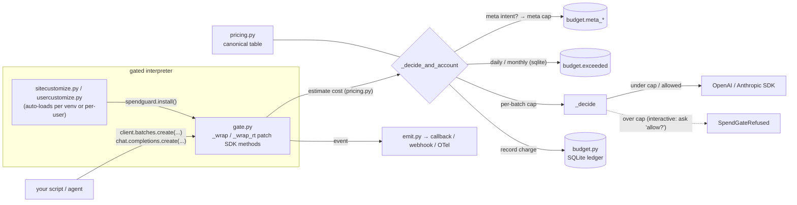
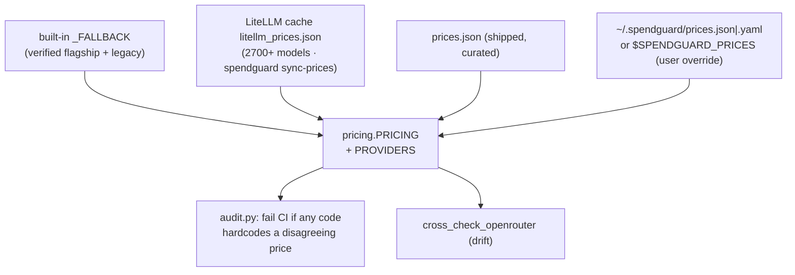
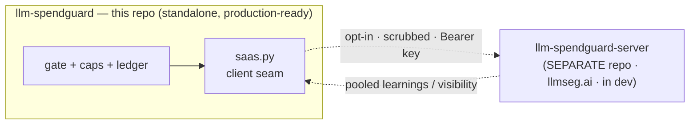
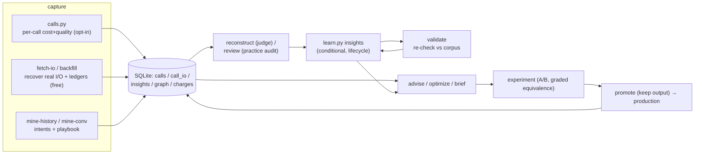

# Architecture

spendguard sits **between your code and the provider SDKs** and does four things in a loop:
**enforce → see → plan/prove → learn.** It's a library + CLI, not a service: zero required deps
(the OpenAI/Anthropic SDKs are lazy-imported and optional), all state under `$SPENDGUARD_HOME`
(default `~/.spendguard`), and **fail-open everywhere** — a bug in the gate must never break your job.

It is built to be **extended, not forked.** Like Postgres' access methods or a WSGI stack, every place
you'd want to plug in — a new SDK, a new event sink, a new price table, a new config knob, a team server —
is a documented seam with a one-call or one-entry extension point. Section 2 is the headline: it walks each
seam. Everything below is grounded in the code under [`src/spendguard/`](https://github.com/llmspendguard/llm-spendguard/tree/main/src/spendguard) (file +
function names are exact so you can jump straight to them).

---

## 1. The chokepoint — request flow (estimate → cap-check → allow/refuse → record → emit)

The gate attaches by **monkeypatching the SDK methods** that actually spend money, so every call in the
interpreter runs the same gauntlet with zero per-script edits.



**The loop, step by step (`gate.py`):**

1. **Intercept.** `install()` (idempotent) patches four batch surfaces (`INTERCEPTORS`) and four real-time
   surfaces (`RT_INTERCEPTORS`) via `_apply`/`_apply_rt`. Each wrapper is tagged `_spend_gated=True` so a
   second `install()` is a no-op. A missing SDK is silently skipped (`ModuleNotFoundError`); any other patch
   failure logs a warning and still installs the rest.
2. **Estimate (zero paid calls).** Batch: `_estimate_openai_jsonl` / `_estimate_anthropic_requests` count
   input tokens (tiktoken `o200k_base`, falling back to `len/4`) and sum each request's `max_tokens` as a
   **conservative output ceiling** — over-estimate, fail safe. Real-time: `_est_oai_chat` / `_est_anth_msg`
   estimate before the call; `_rt_account` reconciles against the response's actual `usage` after.
3. **Cap-check + account** (`_decide_and_account`), in order:
   - **Meta** — if the call's context intent is `spendguard:*`, route to the separate meta cap + meta ledger
     (`_meta_gate`) and stop. The governor governs its own spend (§5).
   - **Cross-process daily/monthly** — `_budget_check` → `budget.exceeded` (only when
     `budget.backend=sqlite`).
   - **Per-batch** — `_decide` compares the estimate to `config.cap()` (`GATE_CAP`, default $75).
   - **Record** — `_budget_record` writes the charge to the SQLite ledger; `calls.record` adds a corpus row
     if call-logging is on.
4. **Allow / refuse / ask** (`_decide`): under cap → log `under_cap`, proceed. Over cap → if a TTY, **ask**
   "allow this $X anyway?" (override + learn); if non-interactive, raise `SpendGateRefused` unless
   `GATE_ALLOW=1`. A refusal records the prevented spend via `guard.record_saving("block", …)`.
5. **Emit.** Every decision flows to `emit.py` sinks (callback / webhook / OTel), best-effort, never blocking.

**Real-time is gated too, with a twist:** output tokens aren't known until the call returns, so the
real-time layer (`_rt_precheck` → call → `_rt_account`) *pre-checks* an estimate against a **per-process
cumulative budget** (`GATE_RT_BUDGET`, default $50 — the runaway-loop guard) and the daily/monthly caps,
then *records actual usage after* (closing the "real-time spend is invisible to reconcile" gap). It
normalizes Anthropic's `input_tokens` (which excludes cache reads) back to OpenAI semantics before pricing
so cached calls aren't under-billed ~2×.

**Two batch chokepoints, same discipline.** The monkeypatch gates the SDK transparently; `submit.py`'s
`guarded_submit()` is the *explicit* alternative a script calls instead of `client.batches.create(...)` —
estimate → enforce `cap_dollars` **and** a `request_cap` (default 25k, OpenAI's limit + blast-radius) →
audit-log → submit. It also refuses if the projection is >20% over a caller-supplied `expected_cost`,
catching bad token assumptions before they bill.

---

## 2. Extensibility seams — built to be extended

This is the headline. Each seam is a stable, documented extension point; adding to it never requires editing
gate logic. If you only read one section, read this one.

### 2a. Gate any SDK — `spendguard.register(...)`

The set of gated SDK methods is a plain list of tuples (`INTERCEPTORS` in `gate.py`); a registry
(`_EXTRA`) holds runtime additions. To gate a **new provider or surface**, write a `gate_fn(kw, args)` that
estimates from the call's arguments and either returns (allow) or raises `SpendGateRefused` (block), then
register it:

```python
import spendguard

def _gate_cohere(kw, args=()):
    est = my_estimate(kw)                 # build {provider, model, requests, in_tok, out_tok, cost}
    spendguard.gate._decide_and_account(est)   # reuse the full cap/record/emit pipeline

spendguard.register("cohere.client", "Client", "chat", _gate_cohere, is_async=False)
spendguard.install()                      # patches your surface alongside the built-ins
```

`register()` appends to `_EXTRA`; the next `install()` patches it through the same `_wrap` → `_guard`
machinery, which means your `gate_fn` inherits **fail-open** automatically (only `SpendGateRefused`
propagates; any other exception logs and lets the call through). No other code changes — the built-in
OpenAI/Anthropic entries use exactly this shape.

### 2b. The adapter pattern — `adapters.register_provider(...)`

`adapters.py` is the provider seam for the `compare` harness (run one prompt across models). Most providers
expose an **OpenAI-compatible** API, so adding one is a single registry entry — name, base URL, key env var,
model-id prefixes, and `kind` (`openai`-compatible or `anthropic`):

```python
from spendguard import adapters
adapters.register_provider("mistral", base_url="https://api.mistral.ai/v1",
                           key_env="MISTRAL_API_KEY", prefixes=("mistral", "codestral"))
```

`provider_for(model)` then resolves `mistral-large` (or explicit `mistral:foo`) to that provider. Because
adapter calls go through the real OpenAI/Anthropic SDKs, **the gate already meters and budgets them** — the
adapter is purely about *which endpoint to hit*, not about bypassing enforcement.

### 2c. Emit sinks — `spendguard.on_event(fn)` / webhook / OTel

`emit.py` fans every gate decision out to three optional, best-effort sinks (none ever blocks or breaks the
gate). spendguard stays the *enforcement* layer; your existing observability stays the dashboard.

- **In-process callback** — register a function (also usable as a decorator):
  ```python
  @spendguard.on_event
  def watch(ev):  # ev = {ts, kind, provider, model, cost, decision, in_tok, out_tok, ...}
      if ev["decision"].startswith("refused"):
          alert(ev)
  ```
  Callbacks run inline — keep them fast.
- **Webhook** — set `emit.webhook` (config) or `$SPENDGUARD_WEBHOOK`; each event is POSTed as JSON on a
  background daemon thread (drop-if-flooded, so high-volume real-time calls are never slowed).
- **OpenTelemetry** — set `emit.otel=true` / `$SPENDGUARD_OTEL`. Emits a `spendguard.cost_usd` counter, a
  `gen_ai.client.token.usage` counter, and a span per call using **OTel GenAI semantic conventions**
  (`gen_ai.system`, `gen_ai.request.model`, `gen_ai.usage.*`). Point your own OTel SDK's OTLP exporter at
  whatever you run — **Langfuse, Helicone, Arize Phoenix, Honeycomb** all ingest OTLP — and events flow there
  with no bespoke per-vendor code.

### 2d. The pricing table — layered override

`pricing.py` resolves a `$/token` number for any model from a layered table, lowest→highest precedence, so
you can correct or extend prices **without touching code and without ever hardcoding a number**:



Precedence: **user override > curated `prices.json` > LiteLLM cache > built-in `_FALLBACK`.** Cost is
computed by `_cost()`, which clamps cached tokens to the input count and applies batch (50%-off) vs real-time
rates and the cache-read discount. To add or fix a model, drop it into `~/.spendguard/prices.json`:

```json
{ "providers": { "openai": { "models": {
    "gpt-5.5": { "in_": 5.0, "out": 30.0, "cached_in": 0.5, "batch_in": 2.5, "batch_out": 15.0 } } } },
  "_meta": { "source": "https://…", "verified": "2026-06-13", "stale_after_days": 45 } }
```

`freshness()` flags a stale table; `cross_check_openrouter()` is a free read-only drift check against
OpenRouter's public prices; `audit.py` is a CI guard that fails the build if any script hardcodes a price
that disagrees with this table (the original sin that 3–4×-undercounted estimates and burned real money).

### 2e. Config schema — declare a knob, get setup + docs for free

`config_schema.py` holds `SETTINGS`, the **declarative registry of every setting**. Each entry names its
`section`, `key`, `store` (`env` | `config.json:<dotpath>` | `email.json:<key>`), default, `kind` (incl.
enums like `enum:memory,sqlite`), and whether it's `secret`. Adding one dict makes the knob appear
automatically in `spendguard config`, the `spendguard init` setup interview, `SETUP.md`, and validation —
the single source of truth a human *or* an LLM reading the repo can enumerate. Resolution is always **env >
file > default** (`config.py`). Secrets live in env or gitignored files (`email.json`, `saas.json`), never in
the repo or `config.json`.

### 2f. SaaS server seam — `saas.py` (opt-in, see §6)

The team/org roll-up is a clean client seam pointed at a *separate* server repo: a documented `/v1` HTTP
contract, one Bearer key as identity, scrubbed data only, fail-safe until the server exists. Covered in §6.

---

## 3. Enforcement levels — per-batch / daily / monthly / meta · real-time vs batch

Caps are layered. The gate checks them in the order shown in §1; each can be set via env (per-process) or
`config.json` (persistent), resolved by `config.class_cap()` / `cap()` / `meta_cap()`.

| Cap | Scope | Default | Backend | Source |
|---|---|---|---|---|
| **Per-batch** (`GATE_CAP`) | one batch submission | $75 | always on | `config.cap()` |
| **Real-time cumulative** (`GATE_RT_BUDGET`) | per-process running total | $50 | always on (in-memory) | `config.rt_budget()` |
| **Daily / monthly — total** (`GATE_TOTAL_DAILY/MONTHLY`) | LLM + compute ceiling, all processes | off | `budget.backend=sqlite` | `config.class_cap("total", …)` |
| **Daily / monthly — LLM sub-cap** (`GATE_LLM_DAILY/MONTHLY`) | OpenAI + Anthropic only, **hard** | off | sqlite | `config.class_cap("llm", …)` |
| **Daily / monthly — compute sub-cap** (`GATE_COMPUTE_DAILY/MONTHLY`) | remote GPU (vast.ai), **alert/soft** | off | sqlite | `config.class_cap("compute", …)` |
| **Meta** (`GATE_META_BUDGET`) | spendguard's own LLM use | $2/day | sqlite | `config.meta_cap()` |

- **Split caps** (`budget.exceeded`): a class sub-cap (LLM vs compute) is checked first, then the total
  ceiling, daily then monthly. This lets you set a *tight LLM limit under a higher overall ceiling.* LLM caps
  are hard (gate-enforced); compute caps are alert/soft because vast.ai launches don't pass through the gate
  (enforced separately in `resources.py`).
- **Real-time vs batch:** the gate patches **both** surfaces — `files`/`batches.create` (batch) and
  `chat.completions`/`messages.create` (real-time). Batch cost is fully known pre-flight (capped before
  submit); real-time cost is pre-checked on an estimate, then trued-up post-call. So the bypass risk is the
  *interpreter*, not the call type.
- **Override paths:** over a per-batch or daily/monthly cap, an interactive run *asks* and a `yes` proceeds;
  non-interactive runs need `GATE_ALLOW=1` (for deliberate big jobs) or a raised cap. The real-time budget
  has its own one-time "allow the rest of this run" bypass (`_rt_bypass`) that loosens **only** the RT
  budget, never the batch/daily/monthly caps.

### Making sure nothing bypasses it
The in-process gate only enforces **where it's installed**. A different interpreter/venv, a different
machine, or raw HTTP (not via the SDK) is **not** gated. Defend in layers, weakest→strongest:

1. **Ubiquitous install (resistant).** Auto-load in every venv (`sitecustomize.py`, what `install-hook`
   writes) **and** the per-user site of system python (`install-hook --user` → `usercustomize.py`, so
   `python3 …` is gated for that interpreter).
2. **See it (detect).** `spendguard doctor` prints **ENFORCING HERE: YES/NO** for the *current* interpreter
   (via `_any_patched()` — checks that at least one SDK method is actually `_spend_gated`). Run it before
   trusting a run; it's what reveals "I'm under un-gated system python."
3. **Fail-closed (refuse).** `spendguard.require()` at the top of a script calls `install()`, then **raises**
   if the gate isn't actually enforcing (wrong venv) or is disabled — instead of silently spending ungated.
   This is the fix for the #1 bypass.
4. **Catch it after (reconcile).** `reconcile-ledger` (and the daily report's leak alert) compares provider
   billing to the local ledger; any ungoverned spend shows up as a **leak** within a day. The net for what
   the in-process layers miss.
5. **True no-bypass (proxy + key custody — roadmap).** The only *guarantee* across any language/machine:
   route all traffic through a spendguard **proxy** that holds the provider keys and enforces server-side.
   This is the natural home of the separate SaaS/server repo (§6, [ROADMAP](ROADMAP.md)). The in-process gate
   stays the zero-infra default; the proxy is the opt-in hard guarantee.

---

## 4. The fail-OPEN safety model

A cost governor on a live submit path must never break a legitimate job. The whole gate is built around that.

- **Only a deliberate refusal blocks.** `_guard()` runs every `gate_fn` so that `SpendGateRefused` (the one
  intentional stop) propagates, while **any other exception** — an estimation bug, a `database is locked`
  under fleet concurrency, a misbehaving third-party `register()`'d fn — is logged and the call proceeds.
- **Fail-open at every layer:** estimation failures in `_gate_openai_files`/`_gate_anthropic` print a WARN
  and allow; `install()` skips a missing or changed SDK rather than crashing import; real-time accounting
  swallows its own errors; `emit.emit()` never raises (observability must not break enforcement).
- **Kill switch, checked before the package even imports.** `GATE_DISABLE=1` (env) or `spendguard off`
  (touches `~/.spendguard/disabled`) disables enforcement; `config.disabled()` is honored by every wrapper,
  and the launcher checks it in `sitecustomize.py` *before* importing the package — so disabling works even
  if the package itself is broken. `spendguard on` / removing the flag re-enables.
- **The deliberate exception to fail-open is `require()`.** A script that *must not* spend ungated opts into
  fail-**closed**: it raises if the gate isn't live. Fail-open is the default so bugs don't break jobs;
  fail-closed is opt-in for spend you refuse to let leak.

---

## 5. The meta cage — the governor governs its own spend

spendguard's own LLM calls (`optimize` / `experiment` / `reconstruct` / `mine` / `review` / `brief --llm`)
run inside `calls.context(intent="spendguard:*")`. The gate detects that intent (`_meta_intent`) and routes
the call to a **separate `caps.meta` budget** ($2/day default) and a `kind='meta'` ledger
(`budget.record_meta`, tagged project `llmseg`) — both for batch (`_meta_gate`) and real-time
(`_rt_precheck` / `_rt_account`). The advisor also **excludes** `spendguard:*` from the corpus it analyzes,
so the governor can't overspend governing or pollute its own learning. Same gate patches enforce it; the CLI
calls `install()` so it holds even when run as `spendguard <cmd>`. The advisor models themselves
(`advisor.model`, `advisor.judge_model`) are configurable but **must be priced** in `pricing.py`
(`config.validate_advisor()`), so the meta estimate and cap can always be computed.

---

## 6. The two-repo split — client (this repo) vs SaaS server (opt-in)



- **This repo is the whole product, standalone.** Gate, pricing, ledger, advisor, reconcile, report,
  slash-commands. Each user keeps their **own** local ledger and sets their **own** caps. It depends on no
  server and works fully offline.
- **The server is a separate repo (`llm-spendguard-server`, llmseg.ai — in development).** `saas.py` is only
  the **client seam**: it reads a connection from `~/.spendguard/saas.json` (or env) and speaks a small,
  versioned `/v1` HTTP contract — `GET /v1/health`, `POST /v1/ledger` (per-day roll-up), `POST/GET
  /v1/insights` (scrubbed learnings), plus device-link and a pull-model command queue. **One Bearer key is
  the identity** — the *server* maps it to the user→team→org hierarchy; the client stores no `team_id`/`org_id`.
- **Partner, not supervisor.** The server is opt-in *visibility + pooled learnings*. It never pushes caps
  down or blocks a user. `visibility=private` (the default) means **nothing leaves the machine**; `team`/`org`
  send only **scrubbed abstracts** (reusing `share.py`'s scrub — task class / model / ratios, never
  $/intent/prompt text). Cadence is configurable (`sync_interval`); `sync(if_due=True)` is cron-safe and
  no-ops when not due. Every call **degrades gracefully** ("not connected") until the server exists — the
  client never breaks waiting on it.
- **Cross-check, not blind trust.** Each pushed row carries a deterministic `uid` (byte-identical to the
  server's), so `spendguard saas crosscheck` diffs local vs server rows for drift / local-only / server-only.

---

## 7. Pricing resolution & the learning loop

(Pricing precedence is detailed in §2d.) Cost = `_cost()` with cached tokens clamped to input and provider
semantics normalized (OpenAI input includes cached; Anthropic excludes it, so the gate adds it back before
pricing). The learning loop turns recorded spend into advice:



**brief** pre-fills a plan → **optimize** recommends the cheapest config that held quality → **experiment**
proves it (cost↓ **and** output-equivalence) → **promote** runs it and keeps the output → the gate enforces,
**reconcile-ledger** catches leaks, **report** emails it, **validate** keeps the learnings true as data
grows → they feed the next **brief**. See [learning-advisor.md](learning-advisor.md) for the advisor's
internals.

---

## 8. Data & isolation

One SQLite file under `$SPENDGUARD_HOME` holds `charges` (the ledger), `calls`, `call_io`, `insights`,
`graph_*`, `model_facts`, `semcache`. Each writer module keeps its own WAL connection; writes that span two
connections to the same file commit in phases to avoid self-deadlock. The ledger tags every charge with a
`project` (env > repo-local `.spendguard.json` > git repo basename > cwd) and a `conv_id` (the chat/session
that spawned it), so spend is attributable per repo and traceable back to its conversation — and a stable
anonymous `usr_<hex>` identity means spend is **never** unattributed. Operational config is `config.json`;
secrets are `email.json` / `saas.json` (gitignored). Nothing is written into the host project.

### Module map
See [`src/spendguard/README.md`](https://github.com/llmspendguard/llm-spendguard/blob/main/src/spendguard/README.md) for a one-line description of every module,
grouped by the four roles (enforce / see / plan-prove / learn).

---

## 9. Known limitations — honest tradeoffs

- **Caps are check-then-record, not transactional.** Under heavy concurrency, N processes can each pass the
  daily/monthly check before any of them records — so cross-process caps are **near-hard, not
  transactional-hard.** A small overshoot is possible at high fan-out.
- **Real-time has no provider cross-check without an Admin key.** `reconcile-ledger` reconciles **batch**
  spend against provider billing; real-time spend is recorded from the SDK's `usage` field and trusted.
- **The in-process gate is interpreter-scoped.** It cannot gate a different python, a different machine, or
  raw HTTP that skips the SDK. The layered defenses (§3) mitigate this; only the roadmap proxy *guarantees*
  it.
- **Estimates are conservative by design.** Output is priced at each request's `max_tokens` ceiling, so the
  pre-flight number over-estimates (fails safe) — pass a measured `avg_out_tokens` to `guarded_submit` for a
  tighter figure.
- **Token counting falls back to a heuristic.** Without `tiktoken`, input is estimated at `len/4`; flagged in
  `submit.py` output. Install `tiktoken` for accuracy.
- **Quality judging of an isolated `(prompt, output)` pair is unreliable** without ground truth — the advisor
  prefers conversation-outcome and approach-quality signals, and `validate`'s cost-gap / `cascade`'s default
  verifier are deliberately labeled coarse heuristics.
- **Very high-volume real-time loops** add per-call SQLite I/O when `backend=sqlite`; keep such loops on the
  in-process memory cap if the ledger write becomes a bottleneck.
