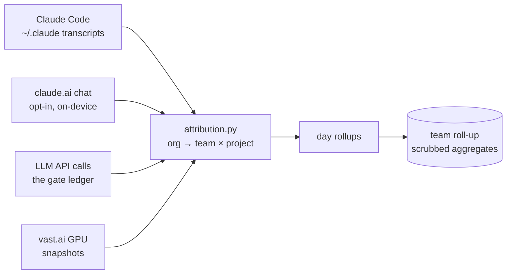

# Work attribution

spendguard doesn't just cap spend — it answers **"what did all this spend and work go toward?"** It folds
every channel (Claude Code, claude.ai chat, raw LLM API calls, rented GPUs) into one **`org → team × project`**
attribution, so a person, a team, or an org can see both the **hard dollars** and the **plan-covered value** of
the work, broken down the same way at every level.

!!! note "Generic by design"
    Nothing here is hardcoded to a particular company, project, or team. The taxonomy is **discovered from your
    own corpus** and confirmed by you; every name comes from your config or the server. The examples below use
    placeholder names.

---

## The reporting model

Spend is reported in distinct categories that are **never lumped together** — hard dollars and estimated value
are kept separate, and value is always qualified (it's "est chat value", not bare "value", because chat and
Claude Code are covered by your subscription, not billed per token):

| # | Category | Kind | Source |
|---|---|---|---|
| ① | **LLM API costs** | hard $ | metered per provider × model |
| ② | **Remote compute** | hard $ | per provider × machine type (e.g. vast.ai GPU) |
| ③ | **Est chat value** | plan-covered estimate | claude.ai / desktop chat |
| ④ | **Est code-chat value** | plan-covered estimate | Claude Code sessions |
| ⑤ | **Cowork** | placeholder | (reserved) |
| ⑥ | **Infra / storage egress** | hard $ | e.g. B2 |

A **subscription line** (per-seat Max + Pro) sits alongside as the fixed cost behind ③/④. Periods are
**day / week / month / quarter / ytd**, and the *same* breakdown renders at **org**, **team**, and **user**
scope.

!!! warning "Don't mix period grains"
    A daily point and a weekly/monthly point are never shown on the same axis — that's the fastest way to make a
    chart lie. Pick one period per view.

---

## Where the data comes from



| Command | What it attributes |
|---|---|
| `spendguard claude-code [show\|sync\|classify\|work\|story]` | mines `~/.claude` transcripts → Claude Code spend + work, classified per session |
| `spendguard chat [test\|show\|discover\|classify\|loop\|work\|story\|sync\|status\|accept]` | the **claude.ai chat adapter** (opt-in, on-device, macOS) |
| `spendguard resources [show\|snapshot\|sync]` | vast.ai GPU → org/team/project; `snapshot` records instances so **destroyed** ones stay reconstructable |
| `spendguard schedule [--daily] [--remove]` | installs the OS-native scheduler that keeps all of the above synced |

---

## The taxonomy is discovered, then confirmed

Attribution uses **contextual reasoning over the content of each day's work**, not brittle path/name rules —
because one person can have many orgs, and one org many projects, and a single conversation can touch several
projects at once.

```bash
spendguard chat discover     # reads your corpus, PROPOSES an `org → team × project` taxonomy
                             #   (seeded from your current one; prints a diff for periodic review)
spendguard chat classify     # assigns each conversation {org, team, allocation:[{project, pct}]}
```

Two dimensions, kept orthogonal:

- **`org → team`** is the *additive* scope tree — every dollar rolls up exactly once.
- **`project[]`** is the *orthogonal, multi-valued* dimension — a conversation's value **splits** across the
  projects it actually touched (allocation percentages that sum to 1.0), so a cross-project session is counted
  once but visible under each project.

Both `discover` and `classify` run under the **caged advisor** budget (a hard meta-cap), and `classify`
without `--run` is an estimate-only dry run.

---

## Consistent classification across a team

When you connect a team roll-up, the **taxonomy lives on the server** (versioned `org_taxonomy`). Every member
**pulls the same taxonomy** before classifying, so the whole org buckets work consistently instead of each
person inventing their own labels:

```bash
spendguard saas pull-taxonomy     # fetch the org's shared taxonomy
spendguard saas push-taxonomy     # propose an update (admins)
```

From the dashboard, an admin can press **"Request attribution"** — that enqueues an `attribute` command the
clients pick up on their next `saas sync` and run locally (on-device; only scrubbed rollups are pushed back).

---

## GPU attribution without false positives

vast.ai exposes no per-day consumption or audit log, so spendguard **records it itself**: every `saas sync`
takes a `resources.snapshot()`, and per-day cost is reconstructed from instance start/end × hourly rate (so a
short-lived box destroyed before the next sync is still counted).

Attribution maps an instance to a project via config (`resources.vastai.label_map`) and, for anything still
unlabeled, by **aligning to conversations** active that day — the same cross-connect the LLM-batch attribution
uses — but **restricted to GPU-capable projects/teams** so an unrelated chat never accidentally claims a GPU
bill. There is **no opinionated default label map**: until you configure one, an unlabeled instance maps to no
project rather than a wrong one.

---

## Keeping it current

```bash
spendguard schedule --daily        # install (macOS launchd · Linux cron · Windows schtasks)
spendguard schedule --remove       # uninstall
```

The scheduler runs `spendguard saas sync --if-due`, which snapshots GPUs, runs the chat loop (if enabled), and
pushes the day's scrubbed rollups. It's idempotent and dependency-free.

!!! note "Privacy & opt-in"
    The chat adapter is **off by default** (`chat.enabled`), runs **entirely on your device**, decrypts *your*
    own session cookie locally, and **never logs, prints, or transmits** it. As with the rest of spendguard,
    only **scrubbed aggregates** (daily totals + generalizable abstracts) ever leave your machine, and only
    when you choose to sync.
